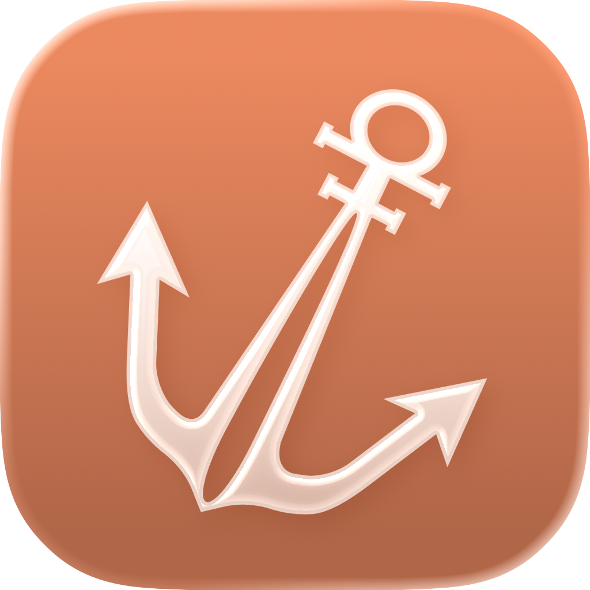

# Sailors

### Write the talk. Practise the talk. Deliver the talk.

**An open-source public-speaking coach for iPhone.** Sailors turns a rough idea into a
speaker-ready script, drills you on it a few minutes a day, and reads it back to you when
you are standing in front of the room.

  
  
  
  

**[Features](#what-sailors-does)** · **[The MVP](#the-mvp)** · **[Plans](#plans)** ·
**[Sponsors](#sponsors--partners)** · **[Team](#the-team)** · **[Contributing](CONTRIBUTING.md)**

 

<!--
  ┌──────────────────────────────────────────────────────────────────────────┐
  │  BANNER — placeholder. Replace with the real artwork when it is ready.   │
  │                                                                          │
  │  Size:      2400 × 1260 px  (2× of 1200 × 630, so it stays crisp on a    │
  │             Retina display and downscales cleanly)                       │
  │  Safe area: keep text inside the middle 2000 × 900 px — GitHub crops     │
  │             the edges on narrow screens                                  │
  │  Format:    PNG or WebP, under 1 MB                                      │
  │  Save to:   apps/mobile/assets/banner.png, then swap the src below       │
  │                                                                          │
  │  The same image at 1280 × 640 also works as the repository social        │
  │  preview: Settings → General → Social preview.                           │
  └──────────────────────────────────────────────────────────────────────────┘
-->

 

## Why we built Sailors

Almost every career has a moment that turns on five minutes of talking. A pitch. A demo. A
standup that suddenly matters. A wedding toast. Most people prepare for those five minutes
by writing something the night before, reading it twice, and hoping.

The tools that exist each solve a third of the problem. A chatbot will write you a script,
then leave you alone with it. A teleprompter will scroll text at you, but it does not care
whether you have ever said the words out loud. A course will teach you theory on a Tuesday
that you cannot recall on the Friday you need it.

**Nobody owns the loop.** Writing, rehearsing and delivering are the same job, and they
belong in the same place — the phone that is already in your pocket when you walk up to
speak.

That is Sailors. One app that takes you from "I have to talk about this on Thursday" to
standing up and doing it, with the reps in between that actually make the difference.

 

## What Sailors does

### 1. Create a script

Describe the talk in a sentence. Attach the brief, the PDF, the deck you were handed.
Set how long you have, who is listening, and the mood you want to strike.

Sailors writes the whole thing:

- **A structured script**, not a wall of text — beats marked `[HOOK]`, `[CORE MESSAGE]`
  and so on, with the phrases that carry weight stressed, and pauses written in where a
  room needs a second to catch up.
- **A deck of practice cards** generated alongside it, one idea per card, each with its
  keywords, a delivery style, and how hard it is meant to land.
- **Written for you specifically.** You tell Sailors your profession and how much speaking
  experience you have, once. Every script after that is pitched at that person — the same
  brief produces a different talk for a first-time founder than for a staff engineer.

### 2. Practise daily to get better at speaking

A script is for one talk. This is the part that changes how you speak in every room.

Every day Sailors gives you one short rep — two minutes, not twenty — built around a
**named framework**: PREP, STAR, SCQA and a growing library of others. Not "be more
confident", but a repeatable structure with a real topic to practise it on, a mood, a
situation, and one tip that makes it stick.

Keep the chain going and you get a **streak**: on the home screen, on an iOS
**home-screen widget**, and in a reminder at the time you choose. Miss a day and life
happens, so there is one **streak restore** a month — offered on the day the streak
breaks and not after, because a streak you can undo at any time was never a streak. The
app warns you before it expires, on time, even if it is closed.

### 3. Teleprompter

The moment itself. Your script, full screen, scrolling at a pace you control.

- **Autoscroll from 0.25× to 3×**, changed from the toolbar mid-sentence, with the current
  speed always shown on the button.
- **Hold the middle to pause** — the "wait, they asked a question" gesture — and **hold
  either edge to run at double speed** while your thumb is down. The same hold language as
  the apps everyone already uses.
- **Drag back to re-read** a line; the scroll carries on from where you left it rather
  than racing to catch up.
- **A stopwatch** on the button, so you know whether you are running long while you are
  still able to do something about it.

### 4. Public decks

Speaking is learned by watching other people do it. Publish a deck and it appears in
**Discover**, where anyone can read the script, practise the cards, and save it. Browse
what other people are working on, take the structure that works, and make it yours.

 

## Also in the app

|  | |
| :-- | :-- |
| 🎙️ **Record your takes** | Record yourself against a deck and play it back. One take per deck, kept on the device and synced for you alone. |
| ✈️ **Works without signal** | Scripts, decks, cards and streaks are cached on the device and render before the network is asked anything. Backstage wifi is a myth; the app assumes so. |
| 🧩 **Native, not a web page** | Built with SwiftUI components, real native navigation, and system materials — it behaves the way an iPhone app is supposed to. |
| 🔔 **Reminders that know the deadline** | The streak alarm is scheduled against the exact minute your streak dies, rescheduled whenever you practise or open the app, and cancelled the moment you are safe. |
| 🎨 **A mascot with feelings** | The character reacts to what you are doing — celebrating, waiting, sulking when a streak breaks. |
| 📳 **Haptics you can feel the shape of** | Every detent, commit and celebration has its own texture, fired on the UI thread so it lands with the frame rather than a beat behind it. One switch in Settings turns the lot off. |

 

## The MVP

Version 1 is a complete loop, not a demo. Everything below is built and running.

| Area | Status |
| :-- | :-- |
| AI script generation, with attachments, duration, audience and mood | ✅ Shipped |
| Practice card decks generated per script | ✅ Shipped |
| Daily framework practice, streaks, restore, reminders | ✅ Shipped |
| iOS home-screen widget — per-state art, copy and tap target | ✅ Shipped |
| Teleprompter with speed control and hold gestures | ✅ Shipped |
| Discover — publish, browse, save, practise public decks | ✅ Shipped |
| Audio recording and playback per deck | ✅ Shipped |
| Subscriptions, paywall and plan management | ✅ Shipped |
| Offline-first cache across the app | ✅ Shipped |
| Delivery feedback — pace, filler words, clarity from your recording | 🚧 Next |
| Android | 🗓️ Planned |

> [!NOTE]
> **Sailors is iOS only.** It is built against iOS 17 and up, and leans on native
> components, widgets and system materials that have no Android equivalent today. An
> Android version is on the roadmap, not in this release.

 

## Plans

Sailors is a paid app. There is no free tier and no credits to ration — one subscription
opens the whole product, and nothing inside it is metered.

| | Without a plan | **Wave** · **Voyager** |
| :-- | :--: | :--: |
| Browse public decks in Discover | ✅ | ✅ |
| Create scripts, decks and practice cards | — | Unlimited |
| Rewrite a script, regenerate its cards | — | Unlimited |
| Daily practice, streaks and the home-screen widget | — | Unlimited |
| Teleprompter | — | Unlimited |
| Record and play back your takes | — | Unlimited |
| Publish your own decks | — | Unlimited |

**Wave** bills monthly and **Voyager** annually. Same product either way — the only
difference is how often you pay for it.

**Why there is no free tier.** Every script, every deck of cards and every rewrite is real
model work, paid for on the first tap. A free tier would mean the people who show up to
practise subsidising the people who never intended to speak. So the trade is honest in the
other direction: nothing is rationed once you are in. Write ten drafts of the same talk if
that is what it takes.

**Public decks are the open door.** Discover needs no plan: download the app, sign in, and
read everything the community has published. The library is genuinely free, rather than the
tool being crippled until you pay.

Billing runs through [RevenueCat](https://www.revenuecat.com/), so plans, prices and the
paywall are configured without shipping an app update.

 

## Under the hood

A short version — the full setup lives in **[CONTRIBUTING.md](CONTRIBUTING.md)**.

<table>
  <tr>
    <td width="20%"><b>iPhone app</b></td>
    <td>&nbsp;Expo SDK 57&nbsp;&nbsp;&nbsp;&nbsp;&nbsp;React Native 0.86&nbsp;&nbsp;&nbsp;&nbsp;&nbsp;TypeScript&nbsp;&nbsp;&nbsp;&nbsp;&nbsp;Expo Router&nbsp;&nbsp;&nbsp;&nbsp;&nbsp;Reanimated&nbsp;&nbsp;&nbsp;&nbsp;&nbsp;Pulsar haptics&nbsp;&nbsp;&nbsp;&nbsp;&nbsp;Skia</td>
  </tr>
  <tr>
    <td><b>Native layer</b></td>
    <td>&nbsp;SwiftUI via <code>@expo/ui</code>&nbsp;&nbsp;&nbsp;&nbsp;&nbsp;WidgetKit&nbsp;&nbsp;&nbsp;&nbsp;&nbsp;system materials</td>
  </tr>
  <tr>
    <td><b>API</b></td>
    <td>&nbsp;FastAPI&nbsp;&nbsp;&nbsp;&nbsp;&nbsp;Python 3.14&nbsp;&nbsp;&nbsp;&nbsp;&nbsp;SQLAlchemy&nbsp;&nbsp;&nbsp;&nbsp;&nbsp;Alembic</td>
  </tr>
  <tr>
    <td><b>Background work</b></td>
    <td>&nbsp;Celery&nbsp;&nbsp;&nbsp;&nbsp;&nbsp;Redis</td>
  </tr>
  <tr>
    <td><b>Data</b></td>
    <td>&nbsp;Postgres&nbsp;&nbsp;&nbsp;&nbsp;&nbsp;Supabase&nbsp;&nbsp;&nbsp;&nbsp;&nbsp;SQLite on device</td>
  </tr>
  <tr>
    <td><b>Object storage</b></td>
    <td>&nbsp;MinIO&nbsp;&nbsp;&nbsp;&nbsp;recordings, briefs and attachments</td>
  </tr>
  <tr>
    <td><b>Identity &amp; billing</b></td>
    <td>&nbsp;Clerk&nbsp;&nbsp;&nbsp;&nbsp;&nbsp;RevenueCat</td>
  </tr>
  <tr>
    <td><b>Models</b></td>
    <td>&nbsp;<b>OpenRouter</b> first, then&nbsp;&nbsp;&nbsp;&nbsp;&nbsp;Ollama&nbsp;&nbsp;&nbsp;&nbsp;&nbsp;Anthropic&nbsp;&nbsp;&nbsp;&nbsp;&nbsp;OpenAI&nbsp;&nbsp;&nbsp;&nbsp;&nbsp;Gemini&nbsp;&nbsp;&nbsp;&nbsp;&nbsp;Groq</td>
  </tr>
  <tr>
    <td><b>Monitoring</b></td>
    <td>&nbsp;Sentry</td>
  </tr>
</table>

> [!NOTE]
> **Script generation is tested on [Ollama](https://ollama.com/)** — it is the default
> provider (`AI_PROVIDER=ollama`), so the whole pipeline runs against a model on your own
> machine: brief in, structured script and practice cards out, no API key and no bill. The
> hosted providers are the same code path behind a different adapter — swap
> `AI_PROVIDER` and the pipeline does not notice.

**Three things worth knowing about the shape of it**

- **Offline-first, including the launch.** Scripts, decks and cards live in an on-device
  SQLite database; preferences, streaks and session state in MMKV. Every screen renders
  from them on the first frame and the network refreshes it afterwards — and the app
  starts from disk when it cannot reach its auth provider at all, rather than waiting on
  a round trip it may never get. Backstage wifi is a myth, so the app never assumes any.
- **Generation never blocks a request.** Scripts and cards are Celery jobs on their own
  queues, and the daily practice content is generated days ahead of being needed.
- **One monorepo.** The iPhone app in `apps/mobile`, the FastAPI service in
  `apps/backend`, wired together with Turborepo.

 

## Sponsors & partners

Sailors was built for the **[RevenueCat Shipaton 2026](https://revenuecat-shipaton-2026.devpost.com/)**.
These are the sponsor tools we actually used. Five of them are in the codebase; the sixth
is in every screen you can see.

<table>
<tr>
<td align="center" width="33%">
  <a href="https://www.revenuecat.com/"> <b>RevenueCat</b></a> 
  Subscriptions, the paywall and the customer centre
</td>
<td align="center" width="33%">
  <a href="https://expo.dev"> <b>Expo</b></a> 
  The app runtime, router, native modules and widgets
</td>
<td align="center" width="33%">
  <a href="https://openrouter.ai/"> <b>OpenRouter</b></a> 
  Model routing in front of the paid provider
</td>
</tr>
<tr>
<td align="center">
  <a href="https://sentry.io/welcome/"> <b>Sentry</b></a> 
  Crash and error monitoring in production
</td>
<td align="center">
  <a href="https://swmansion.com/"> <b>Software Mansion</b></a> 
  Reanimated, Gesture Handler, Screens and Pulsar haptics
</td>
<td align="center">
  <a href="https://mobbin.com/"> <b>Mobbin</b></a> 
  UI reference — the patterns we studied before designing each screen
</td>
</tr>
</table>

 

## The mascot

Sailors has a character, and it does real work — it reacts to the state you are in rather
than decorating the screen.

Every mascot animation is authored in **[Blooby](https://blooby-editor.vercel.app/)**, which
is the primary and preferred source for new mascot art in this project. Build the states
there, export as Lottie / dotLottie, and drop the file in — one file can carry a whole
screen's worth of states.

> Contributing a new mascot pose or animation? Start in
> [Blooby](https://blooby-editor.vercel.app/), not in a drawing tool. See
> [CONTRIBUTING.md](CONTRIBUTING.md#mascots-and-animation).

 

## The team

Sailors is built by two people.

<table>
<tr>
<td align="center" width="50%">
  <a href="https://github.com/divyanshu-patil"> <b>Divyanshu Patil</b></a> 
  Creator
</td>
<td align="center" width="50%">
  <a href="https://github.com/Bhavesh-More"> <b>Bhavesh More</b></a> 
  Creator
</td>
</tr>
</table>

 

## Contributing

Sailors is open source and contributions are welcome — from a typo to a whole screen.
Everything a developer needs (prerequisites, environment variables, running the app and the
API, the architecture, the conventions we hold to and how to open a good pull request)
lives in **[CONTRIBUTING.md](CONTRIBUTING.md)**.

 

## License

[MIT](LICENSE) © Divyanshu Patil and Bhavesh More.

Use it, fork it, ship it, sell it. Just keep the notice.

 
Built with a lot of talking to ourselves.

